# Working with Spatial Data


[<i class="fa fa-file-code-o fa-3x" aria-hidden="true"></i> The R Script associated with this page is available here](04_Spatial.R).  Download this file and open it (or copy-paste into a new script) with RStudio so you can follow along.  

# Setup

## Load packages

```r
library(sp)
library(rgdal)
library(ggplot2)
library(dplyr)
library(tidyr)
library(maptools)
```

# Point data

## Generate some random data

```r
coords = data.frame(
  x=rnorm(100),
  y=rnorm(100)
)
str(coords)
```

```
## 'data.frame':	100 obs. of  2 variables:
##  $ x: num  -0.7755 1.5926 1.038 -0.0797 -1.6608 ...
##  $ y: num  -0.0159 0.7206 0.08 0.7659 0.5246 ...
```


```r
plot(coords)
```

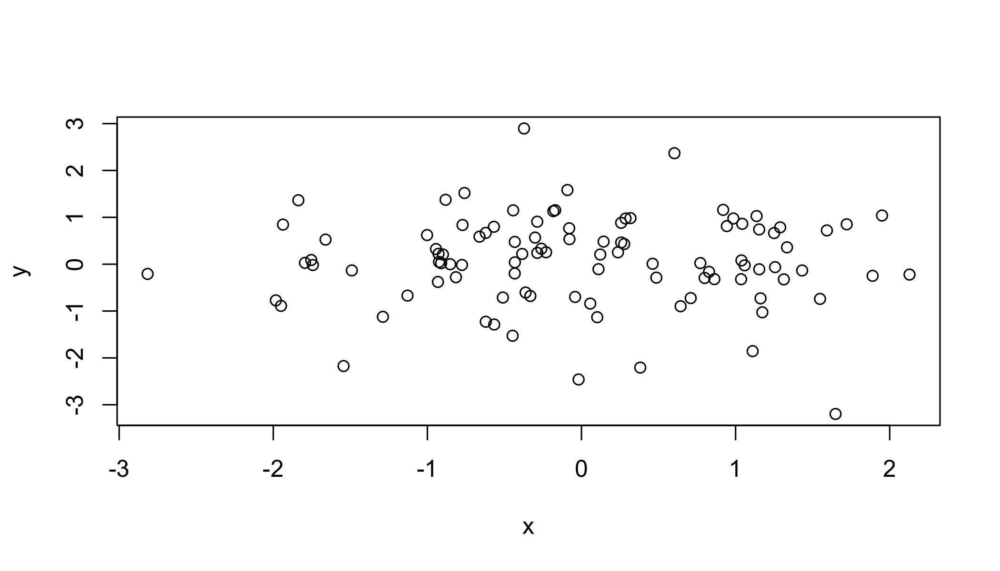<!-- -->


## Convert to `SpatialPoints`

```r
sp = SpatialPoints(coords)
str(sp)
```

```
## Formal class 'SpatialPoints' [package "sp"] with 3 slots
##   ..@ coords     : num [1:100, 1:2] -0.7755 1.5926 1.038 -0.0797 -1.6608 ...
##   .. ..- attr(*, "dimnames")=List of 2
##   .. .. ..$ : NULL
##   .. .. ..$ : chr [1:2] "x" "y"
##   ..@ bbox       : num [1:2, 1:2] -2.82 -3.2 2.13 2.9
##   .. ..- attr(*, "dimnames")=List of 2
##   .. .. ..$ : chr [1:2] "x" "y"
##   .. .. ..$ : chr [1:2] "min" "max"
##   ..@ proj4string:Formal class 'CRS' [package "sp"] with 1 slot
##   .. .. ..@ projargs: chr NA
```


## Create a `SpatialPointsDataFrame`

First generate a dataframe (analagous to the _attribute table_ in a shapefile)

```r
data=data.frame(ID=1:100,group=letters[1:20])
head(data)
```

```
##   ID group
## 1  1     a
## 2  2     b
## 3  3     c
## 4  4     d
## 5  5     e
## 6  6     f
```


Combine the coordinates with the data

```r
spdf = SpatialPointsDataFrame(coords, data)
spdf = SpatialPointsDataFrame(sp, data)

str(spdf)
```

```
## Formal class 'SpatialPointsDataFrame' [package "sp"] with 5 slots
##   ..@ data       :'data.frame':	100 obs. of  2 variables:
##   .. ..$ ID   : int [1:100] 1 2 3 4 5 6 7 8 9 10 ...
##   .. ..$ group: Factor w/ 20 levels "a","b","c","d",..: 1 2 3 4 5 6 7 8 9 10 ...
##   ..@ coords.nrs : num(0) 
##   ..@ coords     : num [1:100, 1:2] -0.7755 1.5926 1.038 -0.0797 -1.6608 ...
##   .. ..- attr(*, "dimnames")=List of 2
##   .. .. ..$ : NULL
##   .. .. ..$ : chr [1:2] "x" "y"
##   ..@ bbox       : num [1:2, 1:2] -2.82 -3.2 2.13 2.9
##   .. ..- attr(*, "dimnames")=List of 2
##   .. .. ..$ : chr [1:2] "x" "y"
##   .. .. ..$ : chr [1:2] "min" "max"
##   ..@ proj4string:Formal class 'CRS' [package "sp"] with 1 slot
##   .. .. ..@ projargs: chr NA
```
Note the use of _slots_ designated with a `@`.  See `?slot` for more. 


## Promote a data frame with `coordinates()`

```r
coordinates(data) = cbind(coords$x, coords$y) 
```


```r
str(spdf)
```

```
## Formal class 'SpatialPointsDataFrame' [package "sp"] with 5 slots
##   ..@ data       :'data.frame':	100 obs. of  2 variables:
##   .. ..$ ID   : int [1:100] 1 2 3 4 5 6 7 8 9 10 ...
##   .. ..$ group: Factor w/ 20 levels "a","b","c","d",..: 1 2 3 4 5 6 7 8 9 10 ...
##   ..@ coords.nrs : num(0) 
##   ..@ coords     : num [1:100, 1:2] -0.7755 1.5926 1.038 -0.0797 -1.6608 ...
##   .. ..- attr(*, "dimnames")=List of 2
##   .. .. ..$ : NULL
##   .. .. ..$ : chr [1:2] "x" "y"
##   ..@ bbox       : num [1:2, 1:2] -2.82 -3.2 2.13 2.9
##   .. ..- attr(*, "dimnames")=List of 2
##   .. .. ..$ : chr [1:2] "x" "y"
##   .. .. ..$ : chr [1:2] "min" "max"
##   ..@ proj4string:Formal class 'CRS' [package "sp"] with 1 slot
##   .. .. ..@ projargs: chr NA
```

## Subset data


```r
subset(spdf, group=="a")
```

```
##                 coordinates ID group
## 1  (-0.775517, -0.01594804)  1     a
## 21   (0.3812662, -2.206719) 21     a
## 41  (0.7711842, 0.02331766) 41     a
## 61 (-0.01874341, -2.460687) 61     a
## 81    (1.043132, 0.8615845) 81     a
```

Or using `[]`

```r
spdf[spdf$group=="a",]
```

```
##                 coordinates ID group
## 1  (-0.775517, -0.01594804)  1     a
## 21   (0.3812662, -2.206719) 21     a
## 41  (0.7711842, 0.02331766) 41     a
## 61 (-0.01874341, -2.460687) 61     a
## 81    (1.043132, 0.8615845) 81     a
```

Unfortunately, `dplyr` functions do not directly filter spatial objects.


<div class="well">
## Your turn

Convert the following `data.frame` into a SpatialPointsDataFrame using the `coordinates()` method and then plot the points with `plot()`.


```r
df=data.frame(
  lat=c(12,15,17,12),
  lon=c(-35,-35,-32,-32),
  id=c(1,2,3,4))
```


 lat   lon   id
----  ----  ---
  12   -35    1
  15   -35    2
  17   -32    3
  12   -32    4

<button data-toggle="collapse" class="btn btn-primary btn-sm round" data-target="#demo1">Show Solution</button>
<div id="demo1" class="collapse">


```r
coordinates(df)=c("lon","lat")
plot(df)
```

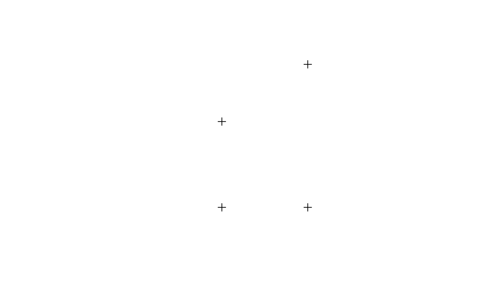<!-- -->

</div>
</div>

## Examine topsoil quality in the Meuse river data set


```r
## Load the data
data(meuse)
str(meuse)
```

```
## 'data.frame':	155 obs. of  14 variables:
##  $ x      : num  181072 181025 181165 181298 181307 ...
##  $ y      : num  333611 333558 333537 333484 333330 ...
##  $ cadmium: num  11.7 8.6 6.5 2.6 2.8 3 3.2 2.8 2.4 1.6 ...
##  $ copper : num  85 81 68 81 48 61 31 29 37 24 ...
##  $ lead   : num  299 277 199 116 117 137 132 150 133 80 ...
##  $ zinc   : num  1022 1141 640 257 269 ...
##  $ elev   : num  7.91 6.98 7.8 7.66 7.48 ...
##  $ dist   : num  0.00136 0.01222 0.10303 0.19009 0.27709 ...
##  $ om     : num  13.6 14 13 8 8.7 7.8 9.2 9.5 10.6 6.3 ...
##  $ ffreq  : Factor w/ 3 levels "1","2","3": 1 1 1 1 1 1 1 1 1 1 ...
##  $ soil   : Factor w/ 3 levels "1","2","3": 1 1 1 2 2 2 2 1 1 2 ...
##  $ lime   : Factor w/ 2 levels "0","1": 2 2 2 1 1 1 1 1 1 1 ...
##  $ landuse: Factor w/ 15 levels "Aa","Ab","Ag",..: 4 4 4 11 4 11 4 2 2 15 ...
##  $ dist.m : num  50 30 150 270 380 470 240 120 240 420 ...
```

<div class="well">
## Your turn
_Promote_ the `meuse` object to a spatial points data.frame with `coordinates()`.

<button data-toggle="collapse" class="btn btn-primary btn-sm round" data-target="#demo2">Show Solution</button>
<div id="demo2" class="collapse">


```r
coordinates(meuse) <- ~x+y
# OR   coordinates(meuse)=cbind(meuse$x,meuse$y)
# OR   coordinates(meuse))=c("x","y")
str(meuse)
```

```
## Formal class 'SpatialPointsDataFrame' [package "sp"] with 5 slots
##   ..@ data       :'data.frame':	155 obs. of  12 variables:
##   .. ..$ cadmium: num [1:155] 11.7 8.6 6.5 2.6 2.8 3 3.2 2.8 2.4 1.6 ...
##   .. ..$ copper : num [1:155] 85 81 68 81 48 61 31 29 37 24 ...
##   .. ..$ lead   : num [1:155] 299 277 199 116 117 137 132 150 133 80 ...
##   .. ..$ zinc   : num [1:155] 1022 1141 640 257 269 ...
##   .. ..$ elev   : num [1:155] 7.91 6.98 7.8 7.66 7.48 ...
##   .. ..$ dist   : num [1:155] 0.00136 0.01222 0.10303 0.19009 0.27709 ...
##   .. ..$ om     : num [1:155] 13.6 14 13 8 8.7 7.8 9.2 9.5 10.6 6.3 ...
##   .. ..$ ffreq  : Factor w/ 3 levels "1","2","3": 1 1 1 1 1 1 1 1 1 1 ...
##   .. ..$ soil   : Factor w/ 3 levels "1","2","3": 1 1 1 2 2 2 2 1 1 2 ...
##   .. ..$ lime   : Factor w/ 2 levels "0","1": 2 2 2 1 1 1 1 1 1 1 ...
##   .. ..$ landuse: Factor w/ 15 levels "Aa","Ab","Ag",..: 4 4 4 11 4 11 4 2 2 15 ...
##   .. ..$ dist.m : num [1:155] 50 30 150 270 380 470 240 120 240 420 ...
##   ..@ coords.nrs : int [1:2] 1 2
##   ..@ coords     : num [1:155, 1:2] 181072 181025 181165 181298 181307 ...
##   .. ..- attr(*, "dimnames")=List of 2
##   .. .. ..$ : chr [1:155] "1" "2" "3" "4" ...
##   .. .. ..$ : chr [1:2] "x" "y"
##   ..@ bbox       : num [1:2, 1:2] 178605 329714 181390 333611
##   .. ..- attr(*, "dimnames")=List of 2
##   .. .. ..$ : chr [1:2] "x" "y"
##   .. .. ..$ : chr [1:2] "min" "max"
##   ..@ proj4string:Formal class 'CRS' [package "sp"] with 1 slot
##   .. .. ..@ projargs: chr NA
```

</div>
</div>

Plot it with ggplot:

```r
  ggplot(as.data.frame(meuse),aes(x=x,y=y))+
    geom_point(col="red")+
    coord_equal()
```

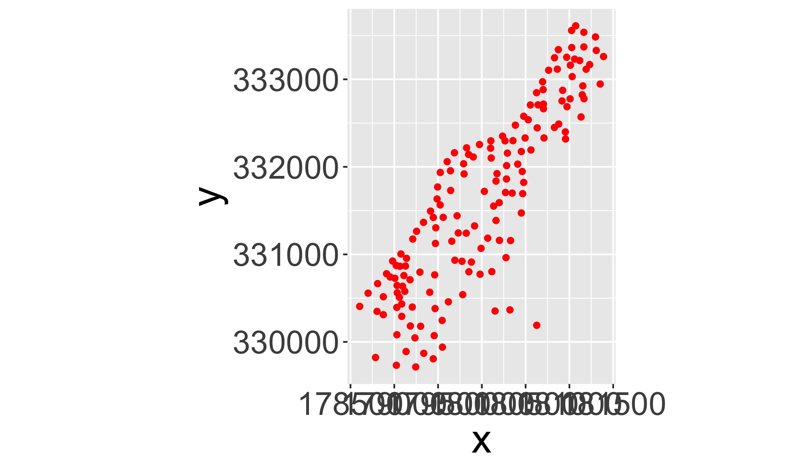<!-- -->

Note that `ggplot` works only with data.frames.  Convert with `as.data.frame()` or `fortify()`.

# Lines

### A `Line` is a single chain of points.


```r
L1 = Line(cbind(rnorm(5),rnorm(5)))
L2 = Line(cbind(rnorm(5),rnorm(5)))
L3 = Line(cbind(rnorm(5),rnorm(5)))
L1
```

```
## An object of class "Line"
## Slot "coords":
##            [,1]       [,2]
## [1,] -0.2266602  1.2389508
## [2,]  0.3506688 -0.6418654
## [3,]  0.5572550 -1.0022352
## [4,] -0.0470298 -1.2565673
## [5,]  0.4880012  0.3211727
```


```r
plot(coordinates(L1),type="l")
```

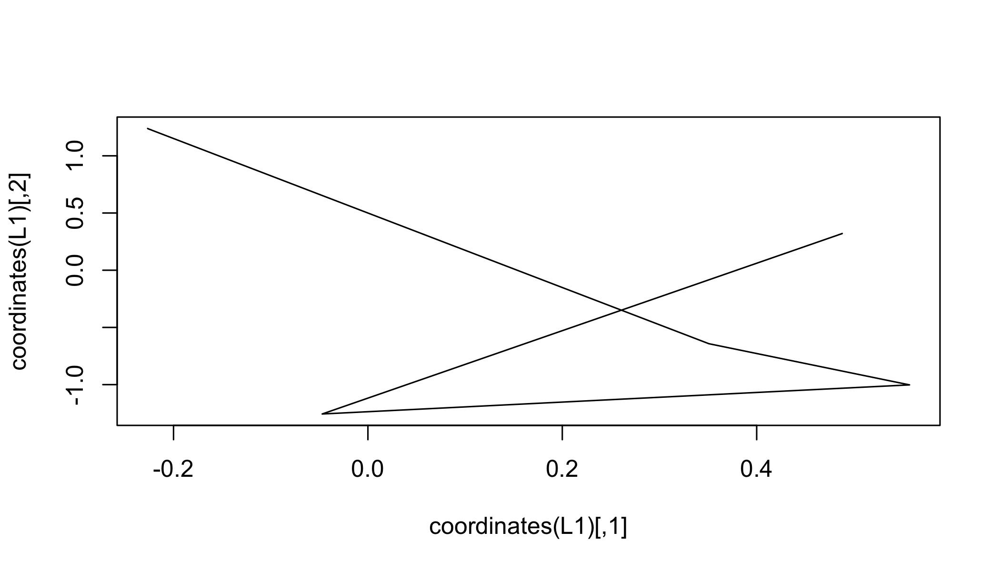<!-- -->


### A `Lines` object is a list of chains with an ID


```r
Ls1 = Lines(list(L1),ID="a")
Ls2 = Lines(list(L2,L3),ID="b")
Ls2
```

```
## An object of class "Lines"
## Slot "Lines":
## [[1]]
## An object of class "Line"
## Slot "coords":
##             [,1]       [,2]
## [1,] -0.26960460 -1.4876681
## [2,]  0.06619791 -2.3025701
## [3,]  0.95283311  0.4591616
## [4,] -2.44938917  0.2783118
## [5,] -0.81758158 -0.4290159
## 
## 
## [[2]]
## An object of class "Line"
## Slot "coords":
##            [,1]       [,2]
## [1,] -0.3868302 -2.2222688
## [2,] -1.4941343  1.1255854
## [3,] -1.2185243  1.2088079
## [4,]  1.1479574 -0.3165272
## [5,] -1.6971661  0.1853546
## 
## 
## 
## Slot "ID":
## [1] "b"
```


### A `SpatialLines` is a list of Lines


```r
SL12 = SpatialLines(list(Ls1,Ls2))
plot(SL12)
```

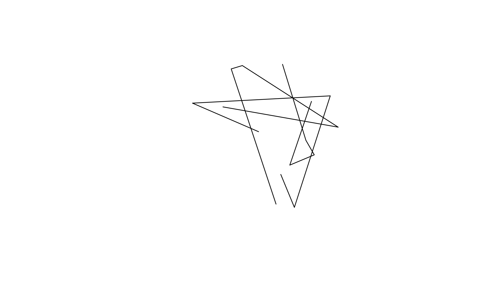<!-- -->


### A `SpatialLinesDataFrame` is a `SpatialLines` with a matching `DataFrame`


```r
SLDF = SpatialLinesDataFrame(
  SL12,
  data.frame(
  Z=c("road","river"),
  row.names=c("a","b")
))
str(SLDF)
```

```
## Formal class 'SpatialLinesDataFrame' [package "sp"] with 4 slots
##   ..@ data       :'data.frame':	2 obs. of  1 variable:
##   .. ..$ Z: Factor w/ 2 levels "river","road": 2 1
##   ..@ lines      :List of 2
##   .. ..$ :Formal class 'Lines' [package "sp"] with 2 slots
##   .. .. .. ..@ Lines:List of 1
##   .. .. .. .. ..$ :Formal class 'Line' [package "sp"] with 1 slot
##   .. .. .. .. .. .. ..@ coords: num [1:5, 1:2] -0.227 0.351 0.557 -0.047 0.488 ...
##   .. .. .. ..@ ID   : chr "a"
##   .. ..$ :Formal class 'Lines' [package "sp"] with 2 slots
##   .. .. .. ..@ Lines:List of 2
##   .. .. .. .. ..$ :Formal class 'Line' [package "sp"] with 1 slot
##   .. .. .. .. .. .. ..@ coords: num [1:5, 1:2] -0.2696 0.0662 0.9528 -2.4494 -0.8176 ...
##   .. .. .. .. ..$ :Formal class 'Line' [package "sp"] with 1 slot
##   .. .. .. .. .. .. ..@ coords: num [1:5, 1:2] -0.387 -1.494 -1.219 1.148 -1.697 ...
##   .. .. .. ..@ ID   : chr "b"
##   ..@ bbox       : num [1:2, 1:2] -2.45 -2.3 1.15 1.24
##   .. ..- attr(*, "dimnames")=List of 2
##   .. .. ..$ : chr [1:2] "x" "y"
##   .. .. ..$ : chr [1:2] "min" "max"
##   ..@ proj4string:Formal class 'CRS' [package "sp"] with 1 slot
##   .. .. ..@ projargs: chr NA
```


# Polygons

## Getting complicated


### Issues

* Multipart Polygons
* Holes

Rarely construct _by hand_...

# Importing data

But, you rarely construct data _from scratch_ like we did above.  Usually you will import datasets created elsewhere.  

## Geospatial Data Abstraction Library ([GDAL](gdal.org))

`rgdal` package for importing/exporting/manipulating spatial data:

* `readOGR()` and `writeOGR()`: Vector data
* `readGDAL()` and `writeGDAL()`: Raster data

Also the `gdalUtils` package for reprojecting, transforming, reclassifying, etc.

List the file formats that your installation of rgdal can read/write with `ogrDrivers()`:

name             write 
---------------  ------
AeronavFAA       FALSE 
ARCGEN           FALSE 
AVCBin           FALSE 
AVCE00           FALSE 
BNA              TRUE  
CartoDB          FALSE 
CouchDB          TRUE  
CSV              TRUE  
DGN              TRUE  
DXF              TRUE  
EDIGEO           FALSE 
ElasticSearch    TRUE  
ESRI Shapefile   TRUE  
Geoconcept       TRUE  
GeoJSON          TRUE  
GeoRSS           TRUE  
GFT              TRUE  
GME              TRUE  
GML              TRUE  
GMT              TRUE  
GPKG             TRUE  
GPSBabel         TRUE  
GPSTrackMaker    TRUE  
GPX              TRUE  
HTF              FALSE 
Idrisi           FALSE 
KML              TRUE  
MapInfo File     TRUE  
Memory           TRUE  
ODS              TRUE  
OpenAir          FALSE 
OpenFileGDB      FALSE 
OSM              FALSE 
PCIDSK           TRUE  
PDF              TRUE  
PDS              FALSE 
PGDump           TRUE  
REC              FALSE 
S57              TRUE  
SDTS             FALSE 
SEGUKOOA         FALSE 
SEGY             FALSE 
SQLite           TRUE  
SUA              FALSE 
SVG              FALSE 
SXF              FALSE 
TIGER            TRUE  
UK .NTF          FALSE 
VFK              FALSE 
VRT              FALSE 
WAsP             TRUE  
WFS              FALSE 
XLSX             TRUE  
XPlane           FALSE 

Now as an example, let's read in a shapefile that's included in the `maptools` package.  You can try 

```r
## get the file path to the files
file=system.file("shapes/sids.shp", package="maptools")
## get information before importing the data
ogrInfo(dsn=file, layer="sids")
```

```
## Source: "/Library/Frameworks/R.framework/Versions/3.3/Resources/library/maptools/shapes/sids.shp", layer: "sids"
## Driver: ESRI Shapefile; number of rows: 100 
## Feature type: wkbPolygon with 2 dimensions
## Extent: (-84.32385 33.88199) - (-75.45698 36.58965)
## LDID: 87 
## Number of fields: 14 
##         name type length typeName
## 1       AREA    2     12     Real
## 2  PERIMETER    2     12     Real
## 3      CNTY_    2     11     Real
## 4    CNTY_ID    2     11     Real
## 5       NAME    4     32   String
## 6       FIPS    4      5   String
## 7     FIPSNO    2     16     Real
## 8   CRESS_ID    0      3  Integer
## 9      BIR74    2     12     Real
## 10     SID74    2      9     Real
## 11   NWBIR74    2     11     Real
## 12     BIR79    2     12     Real
## 13     SID79    2      9     Real
## 14   NWBIR79    2     12     Real
```

```r
## Import the data
sids <- readOGR(dsn=file, layer="sids")
```

```
## OGR data source with driver: ESRI Shapefile 
## Source: "/Library/Frameworks/R.framework/Versions/3.3/Resources/library/maptools/shapes/sids.shp", layer: "sids"
## with 100 features
## It has 14 fields
```

```r
summary(sids)
```

```
## Object of class SpatialPolygonsDataFrame
## Coordinates:
##         min       max
## x -84.32385 -75.45698
## y  33.88199  36.58965
## Is projected: NA 
## proj4string : [NA]
## Data attributes:
##       AREA          PERIMETER         CNTY_         CNTY_ID    
##  Min.   :0.0420   Min.   :0.999   Min.   :1825   Min.   :1825  
##  1st Qu.:0.0910   1st Qu.:1.324   1st Qu.:1902   1st Qu.:1902  
##  Median :0.1205   Median :1.609   Median :1982   Median :1982  
##  Mean   :0.1263   Mean   :1.673   Mean   :1986   Mean   :1986  
##  3rd Qu.:0.1542   3rd Qu.:1.859   3rd Qu.:2067   3rd Qu.:2067  
##  Max.   :0.2410   Max.   :3.640   Max.   :2241   Max.   :2241  
##                                                                
##         NAME         FIPS        FIPSNO         CRESS_ID     
##  Alamance : 1   37001  : 1   Min.   :37001   Min.   :  1.00  
##  Alexander: 1   37003  : 1   1st Qu.:37050   1st Qu.: 25.75  
##  Alleghany: 1   37005  : 1   Median :37100   Median : 50.50  
##  Anson    : 1   37007  : 1   Mean   :37100   Mean   : 50.50  
##  Ashe     : 1   37009  : 1   3rd Qu.:37150   3rd Qu.: 75.25  
##  Avery    : 1   37011  : 1   Max.   :37199   Max.   :100.00  
##  (Other)  :94   (Other):94                                   
##      BIR74           SID74          NWBIR74           BIR79      
##  Min.   :  248   Min.   : 0.00   Min.   :   1.0   Min.   :  319  
##  1st Qu.: 1077   1st Qu.: 2.00   1st Qu.: 190.0   1st Qu.: 1336  
##  Median : 2180   Median : 4.00   Median : 697.5   Median : 2636  
##  Mean   : 3300   Mean   : 6.67   Mean   :1050.8   Mean   : 4224  
##  3rd Qu.: 3936   3rd Qu.: 8.25   3rd Qu.:1168.5   3rd Qu.: 4889  
##  Max.   :21588   Max.   :44.00   Max.   :8027.0   Max.   :30757  
##                                                                  
##      SID79          NWBIR79       
##  Min.   : 0.00   Min.   :    3.0  
##  1st Qu.: 2.00   1st Qu.:  250.5  
##  Median : 5.00   Median :  874.5  
##  Mean   : 8.36   Mean   : 1352.8  
##  3rd Qu.:10.25   3rd Qu.: 1406.8  
##  Max.   :57.00   Max.   :11631.0  
## 
```

```r
plot(sids)
```

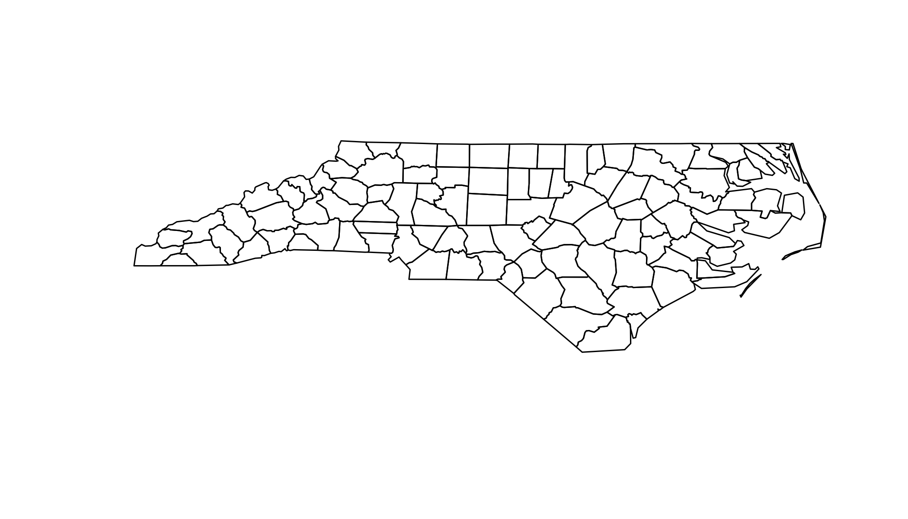<!-- -->


### Maptools package
The `maptools` package has an alternative function for importing shapefiles that can be a little easier to use (but has fewer options).

* `readShapeSpatial`


```r
sids <- readShapeSpatial(file)
```

### Raster data

We'll deal with raster data in the next section.

# Coordinate Systems

* Earth isn't flat
* But small parts of it are close enough
* Many coordinate systems exist
* Anything `Spatial*` (or `raster*`) can have one

## Specifying the coordinate system

### The [Proj.4](https://trac.osgeo.org/proj/) library
Library for performing conversions between cartographic projections. 

See [http://spatialreference.org](http://spatialreference.org) for information on specifying projections. For example, 


#### Specifying coordinate systems 

**WGS 84**:

* proj4: <br><small>`+proj=longlat +ellps=WGS84 +datum=WGS84 +no_defs`</small>
* .prj / ESRI WKT: <small>`GEOGCS["GCS_WGS_1984",DATUM["D_WGS_1984",`<br>`
SPHEROID["WGS_1984",6378137,298.257223563]],`<br>`
PRIMEM["Greenwich",0],UNIT["Degree",0.017453292519943295]]`</small>
* EPSG:`4326`


Note that it has no projection information assigned (since it came from a simple data frame).  From the help file (`?meuse`) we can see that the projection is EPSG:28992.  


```r
proj4string(sids) <- CRS("+proj=longlat +ellps=clrk66")
proj4string(sids)
```

```
## [1] "+proj=longlat +ellps=clrk66"
```

## Spatial Transform

Assigning a CRS doesn't change the projection of the data, it just indicates which projection the data are currently in.  
So assigning the wrong CRS really messes things up.

Transform (_warp_) projection from one to another with `spTransform`


Project the `sids` data to the US National Atlas Equal Area (Lambert azimuthal equal-area projection):

```r
sids_us = spTransform(sids,CRS("+proj=laea +lat_0=45 +lon_0=-100 +x_0=0 +y_0=0 +a=6370997 +b=6370997 +units=m +no_defs"))
```

Compare the _bounding box_:

```r
bbox(sids)
```

```
##         min       max
## x -84.32385 -75.45698
## y  33.88199  36.58965
```

```r
bbox(sids_us)
```

```
##         min       max
## x 1422262.8 2192698.1
## y -984904.1 -629133.4
```

And plot them:


```r
# Geographic
ggplot(fortify(sids),aes(x=long,y=lat,order=order,group=group))+
  geom_polygon(fill="white",col="black")+
  coord_equal()
```

```
## Regions defined for each Polygons
```

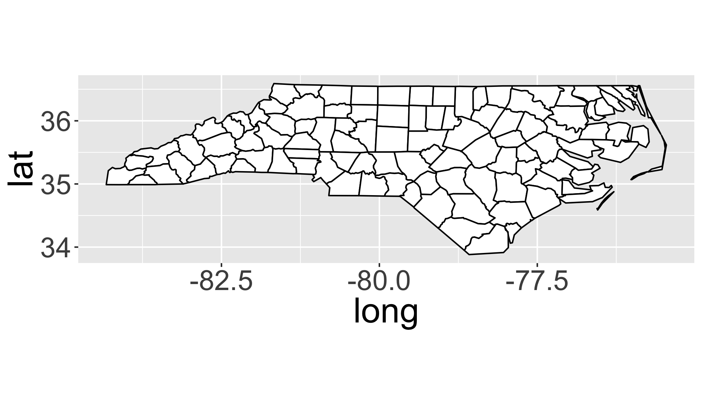<!-- -->

```r
# Equal Area
ggplot(fortify(sids_us),aes(x=long,y=lat,order=order,group=group))+
  geom_polygon(fill="white",col="black")+
  coord_equal()+
  ylab("Northing")+xlab("Easting")
```

```
## Regions defined for each Polygons
```

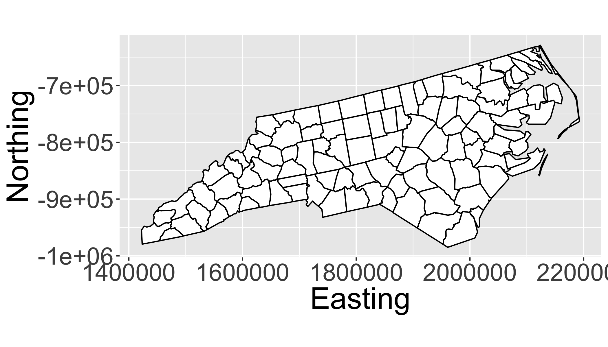<!-- -->

# RGEOS

Interface to Geometry Engine - Open Source (GEOS) using a C API for topology operations (e.g. union, simplification) on geometries (lines and polygons).


```r
library(rgeos)
```

## RGEOS package for polygon operations

* Area calculations (`gArea`)
* Centroids (`gCentroid`)
* Convex Hull (`gConvexHull`)
* Intersections (`gIntersection`)
* Unions (`gUnion`)
* Simplification (`gSimplify`)

If you have trouble installing `rgeos` on OS X, look [here](http://dyerlab.bio.vcu.edu/2015/03/31/install-rgeos-on-osx/)


## Example: gSimplify

Make up some lines and polygons:

```r
p = readWKT(paste("POLYGON((0 40,10 50,0 60,40 60,40 100,50 90,60 100,60",
 "60,100 60,90 50,100 40,60 40,60 0,50 10,40 0,40 40,0 40))"))
l = readWKT("LINESTRING(0 7,1 6,2 1,3 4,4 1,5 7,6 6,7 4,8 6,9 4)")
```


### Simplication of lines


```r
par(mfrow=c(1,4))  # this sets up a 1x4 grid for the plots
plot(l);title("Original")
plot(gSimplify(l,tol=3));title("tol: 3")
plot(gSimplify(l,tol=5));title("tol: 5")
plot(gSimplify(l,tol=7));title("tol: 7")
```

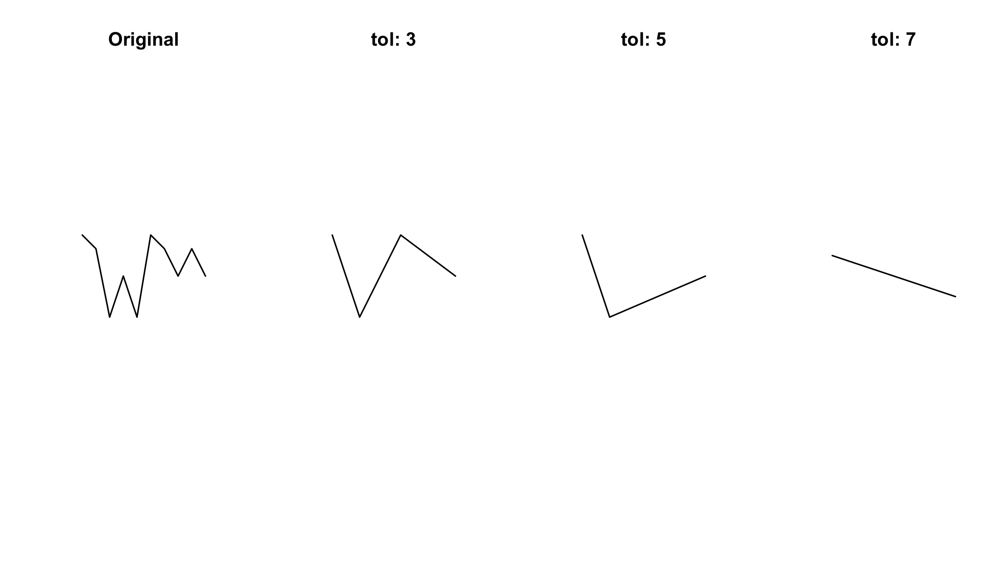<!-- -->


### Simplification of polygons

```r
par(mfrow=c(1,4))  # this sets up a 1x4 grid for the plots
plot(p);title("Original")
plot(gSimplify(p,tol=10));title("tol: 10")
plot(gSimplify(p,tol=20));title("tol: 20")
plot(gSimplify(p,tol=25));title("tol: 25")
```

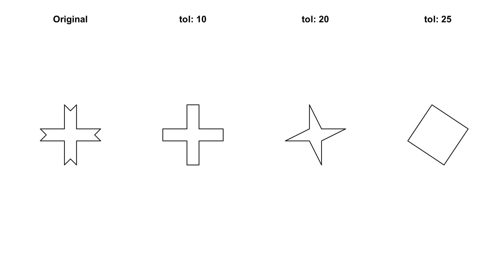<!-- -->


##  Use `rgeos` functions with real spatial data

Load the `sids` data again

```r
file = system.file("shapes/sids.shp", package="maptools")
sids = readOGR(dsn=file, layer="sids")
```

```
## OGR data source with driver: ESRI Shapefile 
## Source: "/Library/Frameworks/R.framework/Versions/3.3/Resources/library/maptools/shapes/sids.shp", layer: "sids"
## with 100 features
## It has 14 fields
```

## Simplify polygons with RGEOS


```r
sids2=gSimplify(sids,tol = 0.2,topologyPreserve=T)
```

### Plotting vectors with ggplot

`fortify()` in `ggplot` useful for converting `Spatial*` objects into plottable data.frames.  


```r
sids%>%
  fortify()%>%
  head()
```

```
## Regions defined for each Polygons
```

```
##        long      lat order  hole piece id group
## 1 -81.47276 36.23436     1 FALSE     1  0   0.1
## 2 -81.54084 36.27251     2 FALSE     1  0   0.1
## 3 -81.56198 36.27359     3 FALSE     1  0   0.1
## 4 -81.63306 36.34069     4 FALSE     1  0   0.1
## 5 -81.74107 36.39178     5 FALSE     1  0   0.1
## 6 -81.69828 36.47178     6 FALSE     1  0   0.1
```

To use `ggplot` with a `fortify`ed spatial object, you must specify `aes(x=long,y=lat,order=order, group=group)` to indicate that each polygon should be plotted separately.  


```r
ggplot(fortify(sids),aes(x=long,y=lat,order=order, group=group))+
  geom_polygon(lwd=2,fill="grey",col="blue")+
  coord_map()
```

```
## Regions defined for each Polygons
```

<!-- -->

Now let's overlay the simplified version to see how they differ.


```r
ggplot(fortify(sids),aes(x=long,y=lat,order=order, group=group))+
  geom_polygon(lwd=2,fill="grey",col="blue")+
  geom_polygon(data=fortify(sids2),col="red",fill=NA)+
  coord_map()
```

```
## Regions defined for each Polygons
```

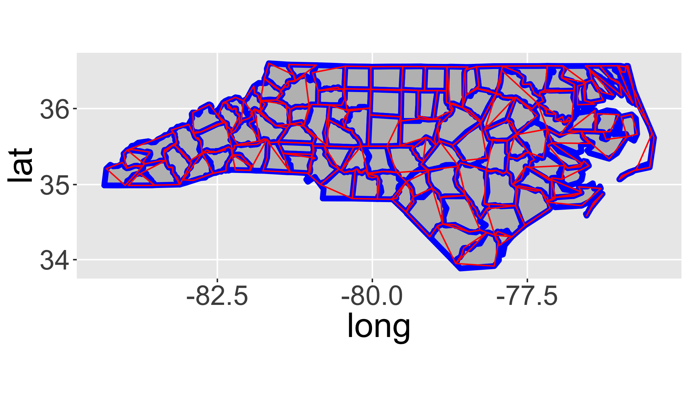<!-- -->

How does changing the tolerance (`tol`) affect the map?

## Calculate area with `gArea`


```r
sids$area=gArea(sids,byid = T)
```


### Plot a chloropleth of area

From [Wikipedia](https://en.wikipedia.org/wiki/Choropleth_map):

> A **choropleth** (from Greek χώρο ("area/region") + πλήθος ("multitude")) is a thematic map in which areas are shaded or patterned in proportion to the measurement of the statistical variable being displayed on the map, such as population density or per-capita income.

By default, the rownames in the dataframe are the unique identifier (e.g. the **FID**) for the polygons.  


```r
## add the ID to the dataframe itself for easier indexing
sids$id=as.numeric(rownames(sids@data))
## create fortified version for plotting with ggplot()
fsids=fortify(sids,region="id")

ggplot(sids@data, aes(map_id = id)) +
    expand_limits(x = fsids$long, y = fsids$lat)+
    scale_fill_gradientn(colours = c("grey","goldenrod","darkgreen","green"))+
    coord_map()+
    geom_map(aes(fill = area), map = fsids)
```

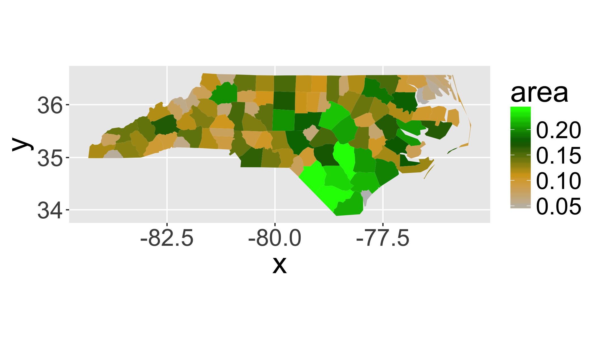<!-- -->

## Union

Merge sub-geometries (polygons) together with `gUnionCascaded()`


```r
sids_all=gUnionCascaded(sids)
```


```r
ggplot(fortify(sids_all),aes(x=long,y=lat,group=group,order=order))+
  geom_path()+
  coord_map()
```

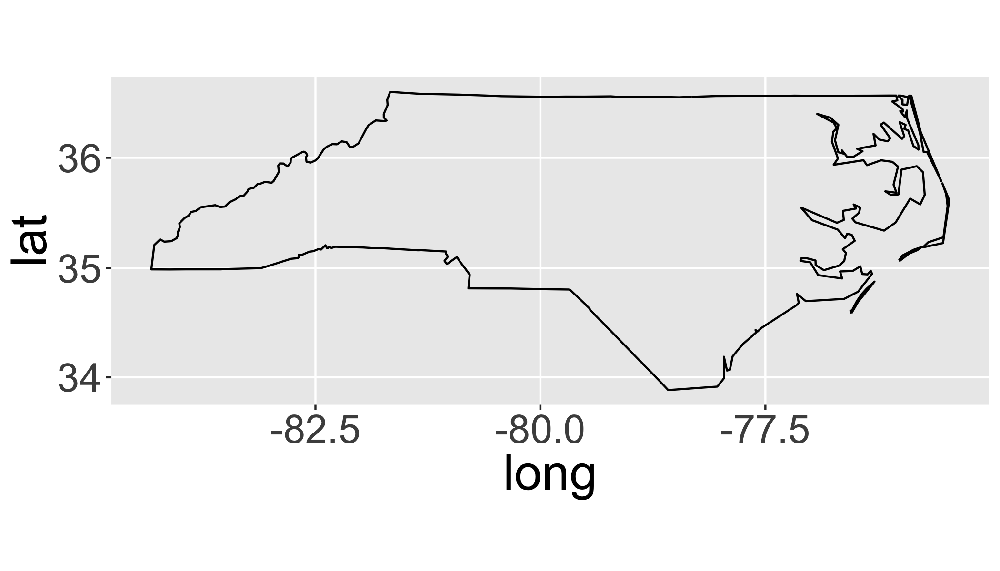<!-- -->


## Colophon
See also:  `Raster` package for working with raster data

Sources:

* [UseR 2012 Spatial Data Workshop](http://www.maths.lancs.ac.uk/~rowlings/Teaching/UseR2012/index.html) by Barry Rowlingson

Licensing: 

* Presentation: [CC-BY-3.0 ](http://creativecommons.org/licenses/by/3.0/us/)
* Source code: [MIT](http://opensource.org/licenses/MIT) 

