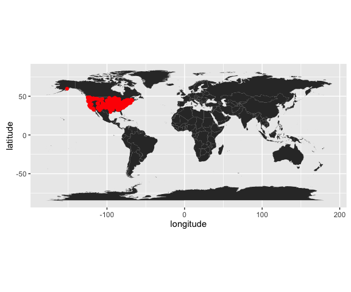

# Demo
Adam M. Wilson  
October 31, 2015  


```r
library(dplyr)
library(ggplot2)
library(maps)
library(spocc)
```

# Introduction

The American Robin is a pretty bird (Figure 1).  


Figure 1: Licensed under CC BY-SA 3.0 via [Wikimedia Commons](https://commons.wikimedia.org/wiki/File:Turdus-migratorius-002.jpg#/media/File:Turdus-migratorius-002.jpg)

# Methods

I aquired all available occurrence records for the American robin (_Turdus migratorius_) from the [Global Biodiversity Information Facility](gbif.org) and mapped them.


```r
## define which species to query
sp='Turdus migratorius'

## run the query and convert to data.frame()
d = occ(query=sp, from='ebird',limit = 1000) %>% occ2df()
```

## Results


```r
# Load coastline
map=map_data("world")

ggplot(d,aes(x=longitude,y=latitude))+
  geom_polygon(aes(x=long,y=lat,group=group,order=order),data=map)+
  geom_point(col="red")+
  coord_equal()
```

<!-- -->

## Conclusion

The spatial distribution of Turdus migratorius is mostly limited to the United states.  Or, more likely, these data are limited to the United States...


