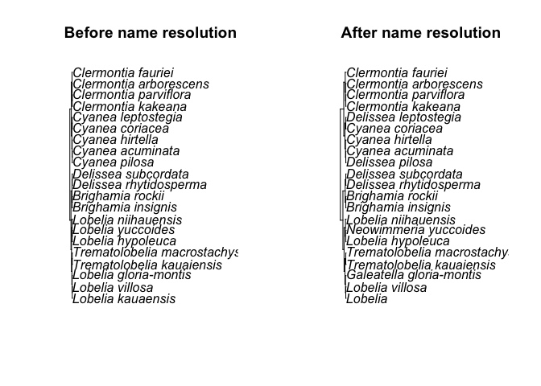

# TNRS
Brad Boyle  


<div>
<object data="3_7_assets/tnrs.pdf" type="application/pdf" width="100%" height="650px"> 
  <p>It appears you don't have a PDF plugin for this browser.
   No biggie... you can <a href="3_7_assets/tnrs.pdf">click here to
  download the PDF file.</a></p>  
 </object>
 </div>
 
 <p><a href="3_7_assets/tnrs.pdf">Download the PDF of the presentation</a></p>  

[<i class="fa fa-file-code-o fa-3x" aria-hidden="true"></i> The R Script associated with this page is available here](3_7_TNRS.R).  Download this file and open it (or copy-paste into a new script) with RStudio so you can follow along.  ** Sorry, this download is not currently working - please follow the code below**


#GUI Example


```r
###############################################
# Example use of TNRS web interface
# By: Naim Matasci & Brad Boyle (bboyle@email.arizona.edu)
# Date: Jan. 5, 2017
###############################################

library(ape)

#Tree topology from Ackerly, D. 2009. Conservatism and diversification of plant functional traits: Evolutionary rates versus phylogenetic signal. PNAS 106:19699--19706.
lobelioids.string<-'((((((Lobelia_kauaensis,Lobelia_villosa),Lobelia_gloria-montis),(Trematolobelia_kauaiensis,Trematolobelia_macrostachys)),((Lobelia_hypoleuca,Lobelia_yuccoides),Lobelia_niihauensis)),((Brighamia_insignis,Brighamia_rockii),(Delissea_rhytidosperma,Delissea_subcordata))),((((Cyanea_pilosa,Cyanea_acuminata),Cyanea_hirtella),(Cyanea_coriacea,Cyanea_leptostegia)),(((Clermontia_kakeana,Clermontia_parviflora),Clermontia_arborescens),Clermontia_fauriei)));'

#Transform the newick sting into an ape phylo object
tree<-read.tree(text=lobelioids.string)

#Obtain the taxa names
old.names<-tree$tip.label

#Change the underscore characters into blank spaces
old.names<-gsub('_',' ',old.names)

# Add an integer identifier to each name
# I've turned the names vector into a two column data frame, but you
# could use a matrix if you prefer
old.names.df <- as.data.frame(old.names)
old.names.df[,2] <- old.names.df[,1]
old.names.df[,1] <- seq(1:nrow(old.names.df))
colnames(old.names.df) <- c("id","Name_submitted")

# Write names and IDs to tab-delimitted file without headers
#  A CSV file would also work
write.table(old.names.df, file="oldnames.csv", 
	row.names=FALSE, col.names=FALSE, sep=",")
	
#############################################
# STOP HERE AND COMPLETE THE FOLLOWING MANUAL 
# STEPS BEFORE CONTINUING
#
# 1. Upload & process names file with TNRS web interface
# (http://tnrs.iplantcollaborative.org/TNRSapp.html)
# 		a. Edit "Name processing settings" on right
# 			i. Select sources. 
#				IMPORTANT! If you choose "TPL", make sure you also 
#				choose ILDIS and GCC. These three together have the same
#				content as The Plant List (www.theplantlist.org)
# 		b. Select tab "Upload and Submit List"
# 		c. Check box "My file contains an identifier as first column"
#		d. Choose file, enter email, and submit
#
# 2. Download results when ready (you will be notified by email)
# 		a. Select tab "Retrieve Results"
#		b. Enter your email and submission key (from notification email)
#		c. Inspect results. When in doubt, use the hyperlinks to research 
#			names at the original source. If you select alternative matches, 
#			these will be downloaded instead as the best match.
#		d. Download the results, with the following options:
#			i. Best matches only
#			ii. Detailed download format
#			iii. UTF-8
#			iv. Rename download file if you wish
#			v. Save the file to this directory
#
# TIP: try using different source to see how they affect you names
#		before and after
#############################################
```


```r
# Import the TNRS results file as a tab-delimitted text file with headers
# Here we are assuming the default file name supplied by TNRS
tnrs.results.filename <- "tnrs_results.txt"
tnrs.results <- read.table(tnrs.results.filename, header=T, sep="\t")

# Merge the old and new names into single data frame, by id
new.names.df <- tnrs.results[, c("user_id", "Name_matched", "Accepted_name")]
names <- merge(old.names.df, new.names.df, by.x=c("id"), by.y=c("user_id"))
names <- data.frame(lapply(names, as.character), stringsAsFactors=FALSE)

# Add a new column to keep clear the distinction between the name matched, 
# the accepted name and the final name used
# Set it to the accepted name to start
names$Final_name <- names$Accepted_name

# If TNRS did not return any accepted name (no match, or name is already accepted), 
# use the final name instead
# WARNING: 
# You might want to research the matched name instead of using it blindly!
names[names[,c("Accepted_name")]=="",c("Final_name")] <-
	names[names[,c("Accepted_name")]=="",c("Name_matched")] 

# Save the old tree for comparison
tree.old <- tree

#The old taxa names are replaced with the corrected taxa names
tree$tip.label<-names[,c("Final_name")]

# Set up mutliplot
par(mfrow=c(1,2))

# Plot the original tree with old names
plot(tree.old, main="Before name resolution")

# Plot the tree with resolved names
plot(tree, main="After name resolution")
```

# API Example


```r
###############################################
# Example use of TNRS api
# By: Naim Matasci
###############################################

library(ape)
library(rjson)	
library(RCurl) 

tnrs.api<-'http://tnrs.iplantc.org/tnrsm-svc'

#Tree topology from Ackerly, D. 2009. Conservatism and diversification of plant functional traits: Evolutionary rates versus phylogenetic signal. PNAS 106:19699--19706.
lobelioids.string<-'((((((Lobelia_kauaensis,Lobelia_villosa),Lobelia_gloria-montis),(Trematolobelia_kauaiensis,Trematolobelia_macrostachys)),((Lobelia_hypoleuca,Lobelia_yuccoides),Lobelia_niihauensis)),((Brighamia_insignis,Brighamia_rockii),(Delissea_rhytidosperma,Delissea_subcordata))),((((Cyanea_pilosa,Cyanea_acuminata),Cyanea_hirtella),(Cyanea_coriacea,Cyanea_leptostegia)),(((Clermontia_kakeana,Clermontia_parviflora),Clermontia_arborescens),Clermontia_fauriei)));'

#Transform the newick sting into an ape phylo object
tree<-read.tree(text=lobelioids.string)

#Obtain the taxa names
old.names<-tree$tip.label

#Change the underscore characters into blank spaces
old.names<-gsub('_',' ',old.names)

#Transforms the vector into a string
old.names<-paste(old.names,collapse=',')

#The string needs to be URL-encoded
old.names<-curlEscape(old.names)

#Send a request to the TNRS service
url<-paste(tnrs.api,'/matchNames?retrieve=best&names=',old.names,sep='')
tnrs.json<-getURL(url) 

#The response needs to be converted from JSON
tnrs.results<-fromJSON(tnrs.json)

#The corrected names are extracted from the response
names<-sapply(tnrs.results[[1]], function(x) c(x$nameSubmitted,x$acceptedName))
names<-as.data.frame(t(names),stringsAsFactors=FALSE)

#If TNRS did not return any accepted name (no match, or name is already accepted), the submitted name is retained
names[names[,2]=="",2]<-names[names[,2]=="",1] 

# Save the old tree so we can compare
tree.old <- tree

#The old taxa names are replaced with the corrected taxa names
tree$tip.label<-names[,2]

# Set up mutliplot
par(mfrow=c(1,2))

# Plot the original tree with old names
plot(tree.old, main="Before name resolution")

# Plot the tree with resolved names
plot(tree, main="After name resolution")
```

<!-- -->
