# SDMs with Wallace
Cory Merow  
1/25/2017  


<div>
<object data="4_1_assets/4_1_SDMs_Intro.pdf" type="application/pdf" width="100%" height="700px">
  <p>It appears you don't have a PDF plugin for this browser.
   No biggie... you can <a href="4_1_assets/4_1_SDMs_Intro.pdf">click here to
  download the PDF file.</a></p>
 </object>
 </div>

 <p><a href="4_1_assets/4_1_SDMs_Intro.pdf">Download the PDF of the presentation</a></p>

[<i class="fa fa-file-code-o fa-3x" aria-hidden="true"></i> The R Script associated with this page is available here](4_1_Wallace_SDMs.R).  Download this file and open it (or copy-paste into a new script) with RStudio so you can follow along.  

# Setup
For `wallace` to work, *you need the latest version of R* (or at least later than version 3.2.4). Download for 
[Windows](https://cran.r-project.org/bin/windows/base/) or [Mac](https://cran.r-project.org/bin/macosx/).

Load necessary libraries. 

```r
install.packages('knitr',dep=T) # you need the latest version, even if you already have it
install.packages('wallace',dep=T)
library(wallace)
run_wallace() # this will open the Wallace GUI in a web browser
```

The `wallace` GUI will open in your web browser and the R command line will be occupied (you only get a prompt back by pushing 'escape'). If you find this annoying and want to use your typical R command line, open a terminal window, type `R` to start R, and then run the lines above in that window. This will tie up your terminal window but not your usual R command line (e.g. RStudio, or the R GUI). *You need to avoid exiting your browser window or closing the R window that initiated `wallace` or you'll have to start over! Luckily that's pretty fast...* Using the terminal looks like this:

<br>
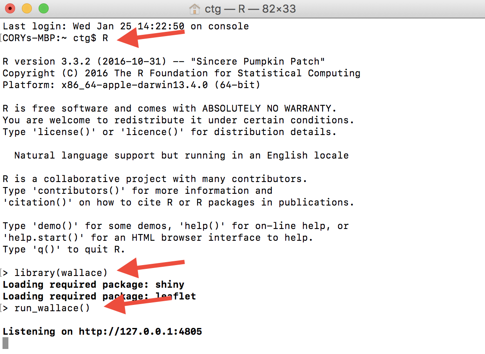

<br>
Typing `run_wallace()` will give you the following in your web browser:

<br>


# Get Occurrence Data

Start by getting about 300 records of *Acer rubrum* (red maple) from GBIF. Throughout, I'll use a red arrow in the images below to indicate which buttons I'm referring to.


<br>


<br>
While you're at it, download the data for later use (bottom left).

Notice that there are tabs along the top, and you can view the sources of the occurrence data. Later you can choose to ditch some if it looks suspect.

<br>
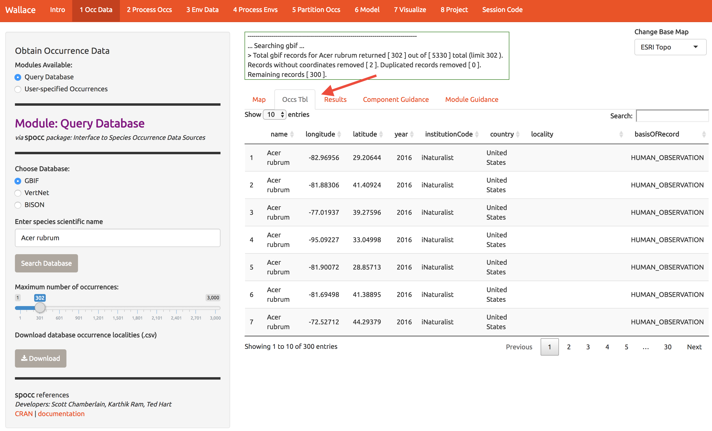


<br>
Each *Module* (the tabs labeled 1-8 at the top of the screen) comes with guidance and references by select the tabs at the right.

<br>


# Prep Occurrences

Now let's clean up the data. If we want to model *A. Rubrum* in the US, we can toss that odd point in Europe. Click the point to see it's info and then enter the ID at the left to remove it.

<br>
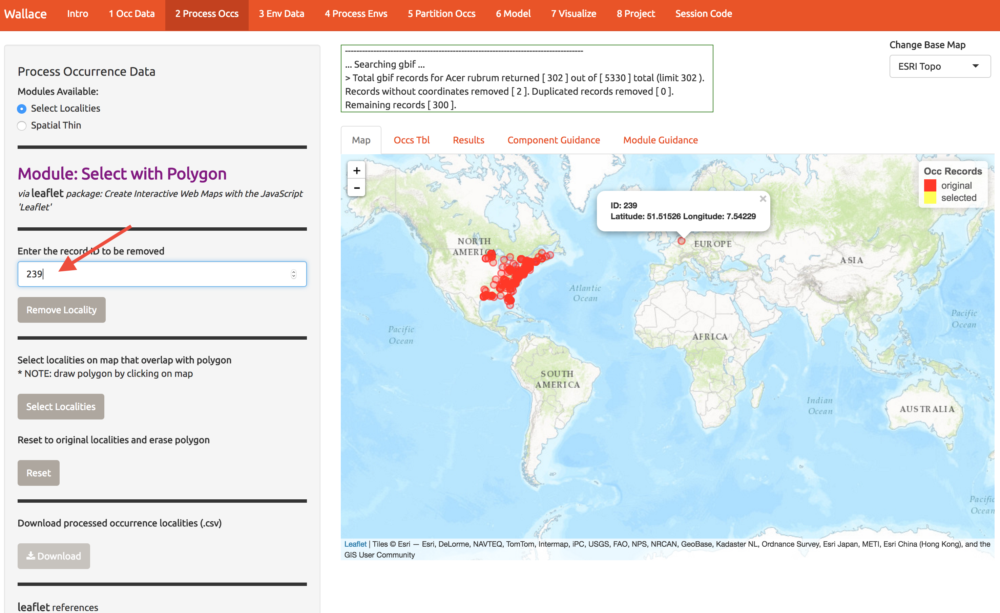

<br>
The samples may exhibit spatial autocorrelation, which is best to account for in the model or remove before modeling. For example, there might be a bunch of samples near cities because these are mostly from iNaturalist (citizen science) and citizen often live near cities. So lets spatially thin the points and make sure they're all at least 10km from one another. It takes a sec. That left me with 163 points for modeling (yours may be different).


<br>

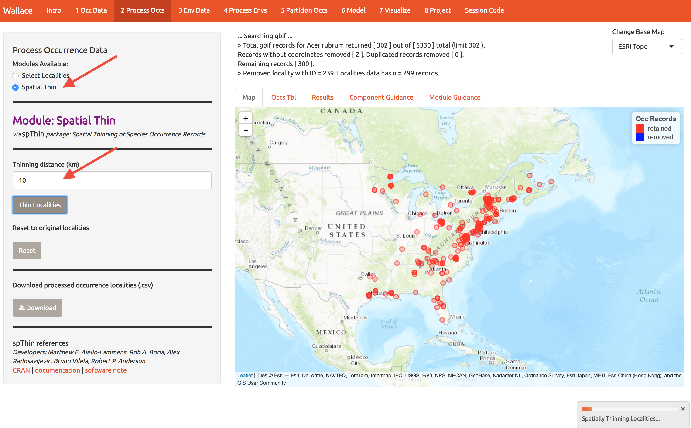

<br>

Download these points for later reference.

# Get environmental data

Now we need some covariates to describe occurrence patterns. Worldclim is global climate data base that is very popular to both use and complain about. It seems pretty good in regions with lots of weather stations, but has issues, especially with precipitation-related things. Lesson: statistical models have problems if you don't have data. So its perfectly good for coarse resolution work, and was a decade ahead of competitors that are only emerging now. We'll add those to Wallace eventually.

Choose the *10 arcmin* data and press download. The first time you use `wallace` these data are slowly downloaded; after that you don't have to wait. *Don't select finer resolution* or you'll be downloading while the rest of us are modeling. 

<br>

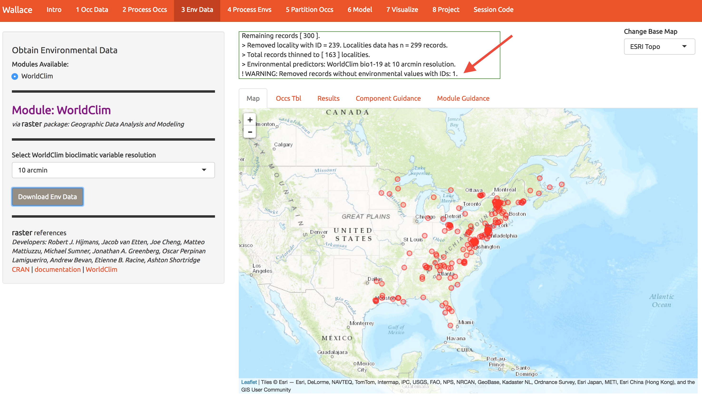
Notice that the log window notes that one point was discarded because environmental data were not available.

<br>

# Prep environmental data

Now we need to choose the extent of the modeling domain. This jargon means that we have to define a sensible region to fit the model. Contrary to many publications, species ranges are not typically best modeling on domains defined by squares or political boundaries. Press some buttons on this screen to explore the options, but end up with something like what I show below. We'll explore the consequences shortly. Press the *Mask* button to trim the environmental layers to this polygon and download the result.

<br>

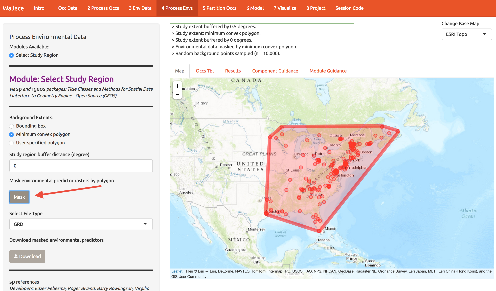

<br>

# Partition occurrences

In order to check whether you've built a decent model, you need some data to validate it. One solution is to partition your data into subsets (here 4) and build a models while witholding 1 subset at a time. Here we have 4 subsets, so we build 4 models, allowing us to get 4 independent measures of model performance. This is called k-fold cross-validation, and here k=4. There's a whole literature on how to best make these subset; one option is to just do it randomly. A better option is to spatially stratify so that your model is forces to predict to regions that weren't used for fitting. If it predicts well, you know you've got the general patterns right and have avoided overfitting to noise in the data. Below, I show some options for spatial stratification. Notice the 4 folds are now shown as 4 colors. Again, download the data.

<br>
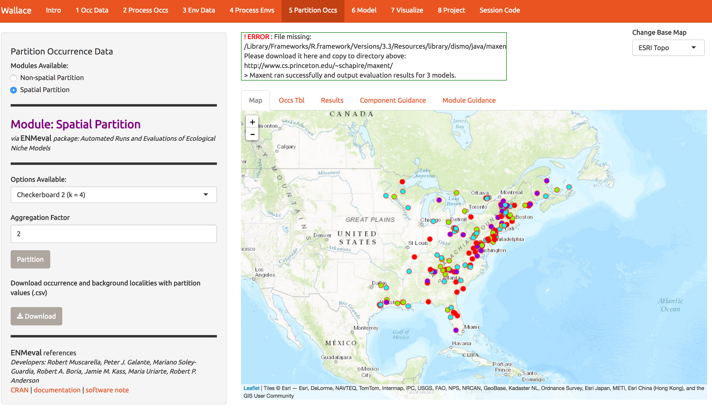


<br>
Take a moment to scroll through the log window at the top of the screen and review all the steps you've taken so far.


# Model

<div>
<object data="4_1_assets/4_1_SDMs_Similarity.pdf" type="application/pdf" width="100%" height="700px">
  <p>It appears you don't have a PDF plugin for this browser.
   No biggie... you can <a href="4_1_assets/4_1_SDMs_Similarity.pdf">click here to
  download the PDF file.</a></p>
 </object>
 </div>

 <p><a href="4_1_assets/4_1_SDMs_Similarity.pdf">Download the PDF of the presentation</a></p>


Finally, we're going to make use of that results tab in the middle of the screen. Let's build a Maxent model; this is a machine learning method that fits wiggly functions to patterns in the data. Its great for exploring complex patterns. If you construct it with a particular set of decisions it becomes very similar to a simple GLM. So it can conver a wide spectrum of complexity. If you want more details, ask Cory; he's written a lot of papers on this so he may talk for while....

Below I've chosen some modeling options:

  - Select the Maxent button
  - Select LQH features. These are the shapes that can be fit to the data: 
    + L = Linear, e.g. temp + precip
    + Q = Quadratic, e.g. temp^2 + precip^2
    + P = Product, e.g. interaction terms of the form temp*precip
    + H = Hinge, e.g. piecewise linear functions. Taking all possible pairs of these between data points, you can build a very flexible function, similar to a GAM (generalized additive model).
    + T = Threshold, e.g. step functions between each pair of data points

<br>


  - Select regularization multipliers between 1-3
    + regularization is a way to reduce model complexity. Higher values = smoother, less complex models. Its kind of like using AIC during model fitting to toss out certain predictors. Just ask for more details.
  - RM Step Value = 1
    + how large of step to take between values in the slide bar above.

This takes about 2 min; you're building 3 model types and 4 folds for each, and you're using a load of features...

<br>
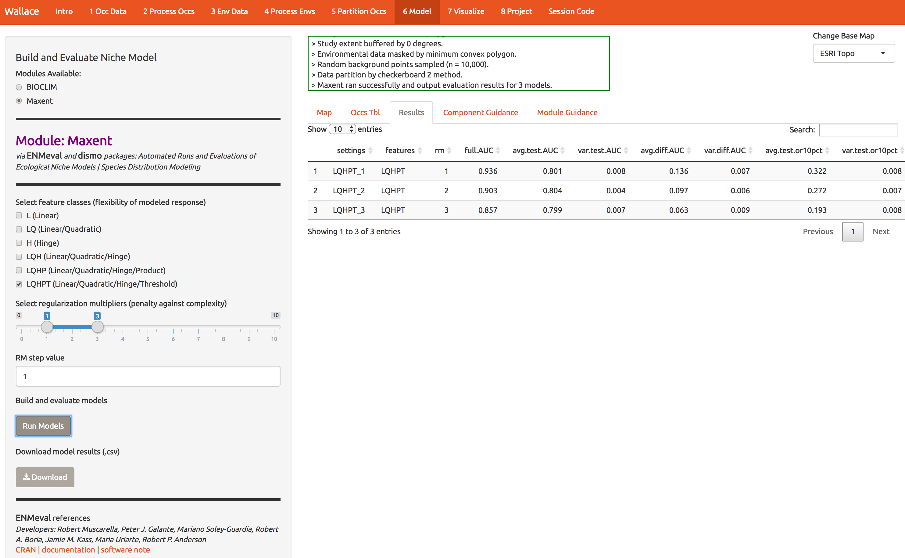

<br>
Notice that the first time I ran this, I got an error, which you may get too. You need to put the maxent software (maxent.jar) in the directory where `wallace` will look for it. This is a bug we're working on. As the log window indicates, download the file and put it in the appropriate directory. Then click *Run Models* again. The result is number of statistics to compare the different models you just built. There should be 3: one for each of the regularization multipliers 1,2,3.

<br>
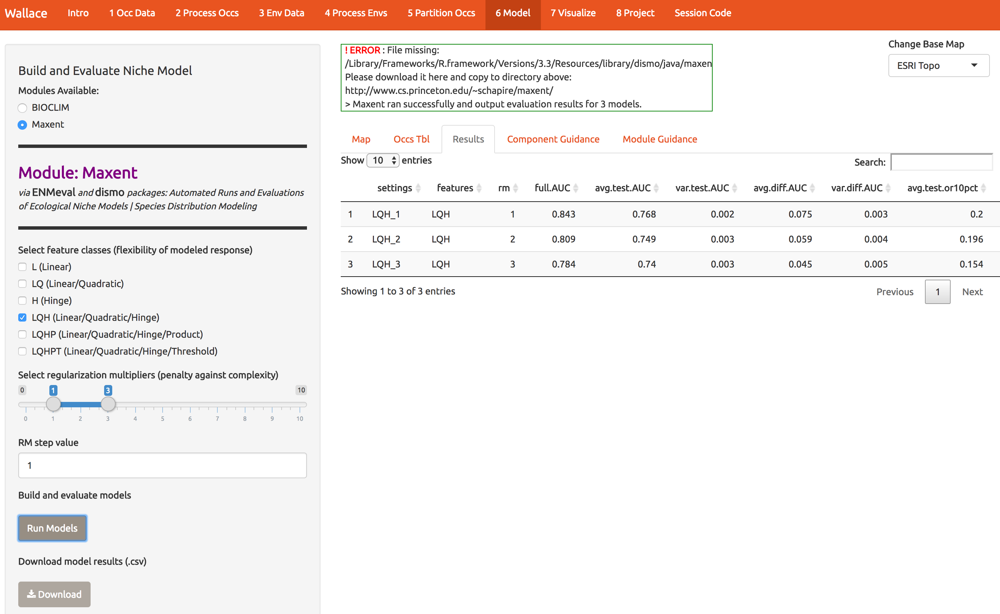


<br>

# Visualize
Now let's see which model performs best. Statistics based on the data witheld from fitting (*test data*) are the most reliable for determining the model's generality and ability to transfer to other locations. The model with regularization mulitiple = 2 appears to be the best model based on avg.test.auc=0.804. Moving to the Visualize tab (module 7), you can plot the performance statistics across models. Explore the options a little.

<br>
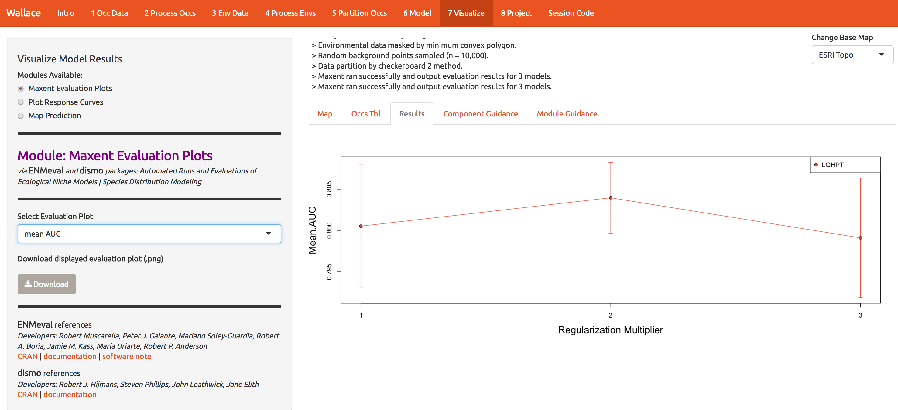

<br>

To evaluate whether the model makes biological sense, we can look at *response curves* that define how each predictor (x-axis) relates to suitability (y-axis). The modal shape seems reasonable; there are places where the temp range is both too wide and too narrow for A. rubrum. The little jagged pieces intuitively seem like overfitting; why would a species, over an evolutionary time span, have an abrupt dip in response to temp range (as seen around 430). (Note that the units are degrees C x 100; worldclim serves the files this way to compress them.)

The *bioclim* predictors are a series of summaries of temp and precip that have been determined to have some biological significance. They're all listed [here](http://www.worldclim.org/bioclim). bio7, seen below, is the annual temperature range.

<br>

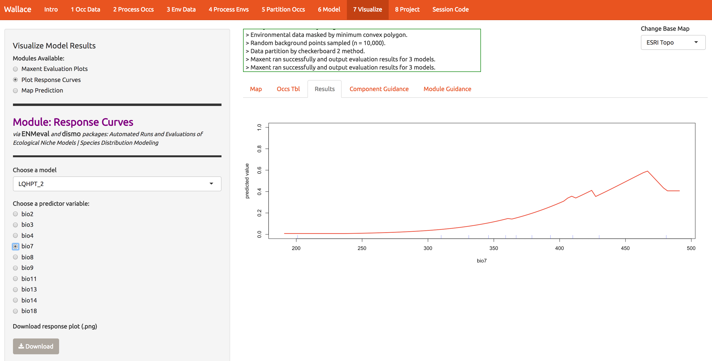
<br>

We can also map the predictions. At first glance it looks like a decent model because the presence points correspond to regions of higher suitability.

<br>

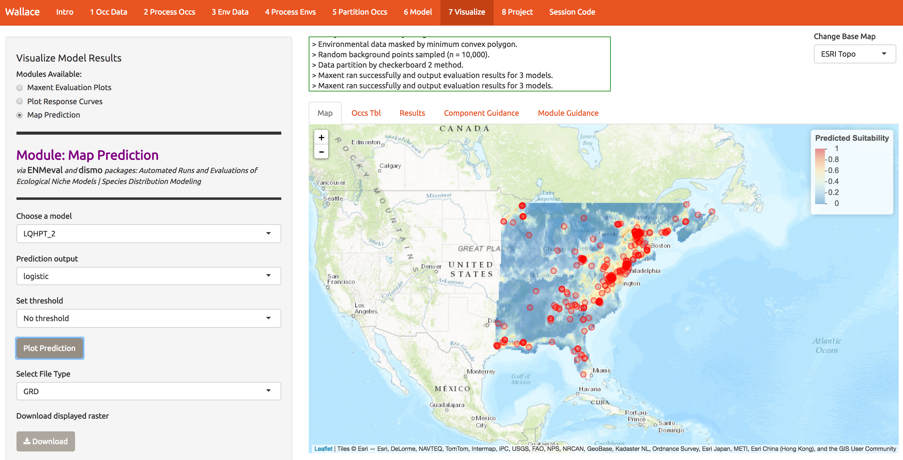

<br>

# Project

Next we can evaluate the models ability to project first to new locations (extending the domain) and new times (2070). First, extend the domain by drawing a polygon like the one below. Double-clicking on each of the 4 corners of this one draws the polygon. Next, press `Select` and then `Project` to build the new map.

<br>

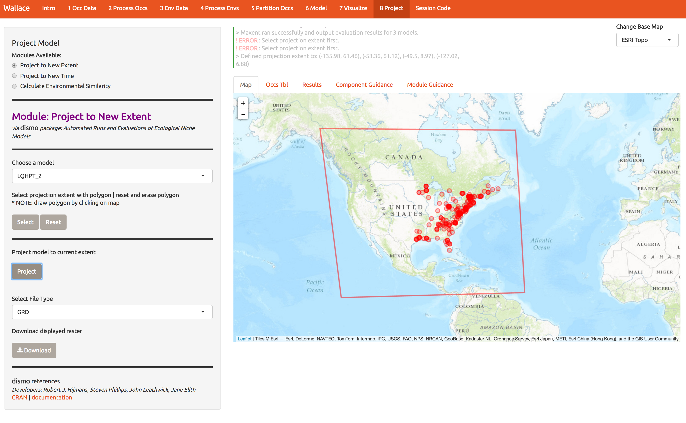

<br>

Below are the predictions to a much larger region. Looks like northern Canada should get ready for a red maple invasion... So it appears we've fit a response that doesn't generalize well to other regions. One way to determine how that happened is to look back at the response curves to determine which predictors are contributing to high suitability in northern Canada. This is best done with MESS plots in the maxent software package, and we haven't included those in `wallace` just yet. So we'll explore another way to avoid this poor prediction below.


As another example, of `wallace`'s features, we can also project to future climate scenarios. Select the options as below and forecast the future range of A. rubrum under an extreme climate change scenario.
<br>

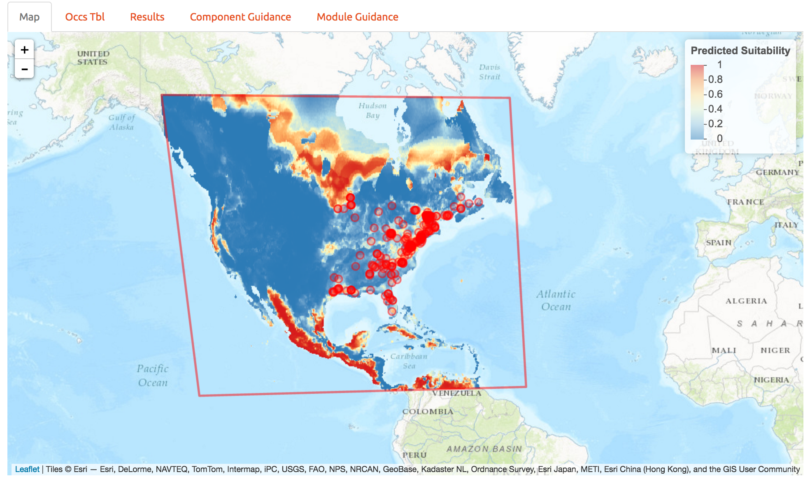


<br>

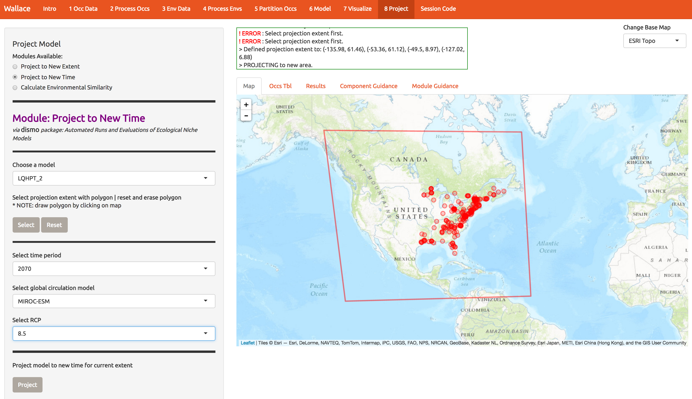


<br>

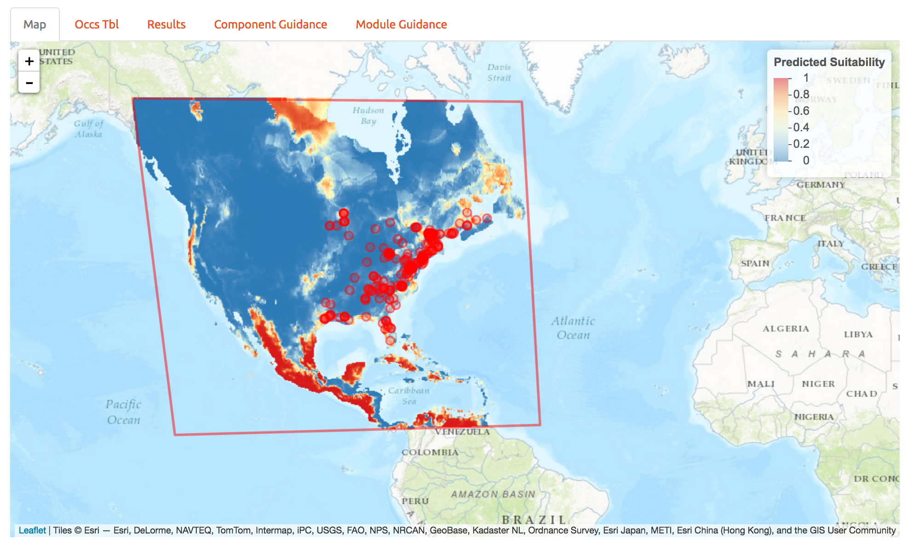

<br>

# Extracting the code

A major advantage of `wallace` compared to other GUI-based software is that you can extract all the code used to run the analysis. This allows you to recall what you did, share it, or modify it. The code is best extracted in *R markdown* format, which is a convienient format for combining R and text (and actually forms the basis of this website). Other formats are also available; for example Microsoft Word output mught be useful if you live in the '90s.

To download the code, select Rmd and click Download. You may need to go to your R window and allow R to set up a cache to proceed. Extraction takes a minute; currently it has to rerun all the analyses we just did. We'll fix this in an upcoming release to avoid the redundancy.

<br>

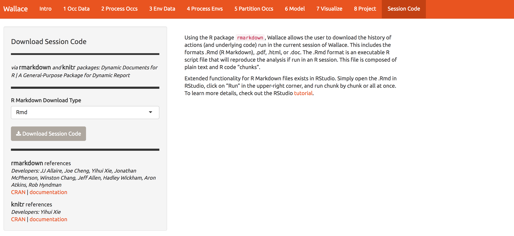

<br>

Now, you should have an .Rmd file that contains your complete analysis. Sometimes, if you make a bunch of mistakes while playing with the GUI, you might get an error when extracting the .Rmd. If that happens, you can download mine [here](https://cmerow.github.io/RDataScience/4_1_assets/Outputs/wallace-session-2017-01-26.Rmd)

Rmd files combine regular text with *code chunks*, shown by the red arrow below. Modules from `wallace` are indicated as headers denoted by *###*. For a quick reference to Rmd syntax, see [here](https://www.rstudio.com/wp-content/uploads/2015/02/rmarkdown-cheatsheet.pdf)

<br>

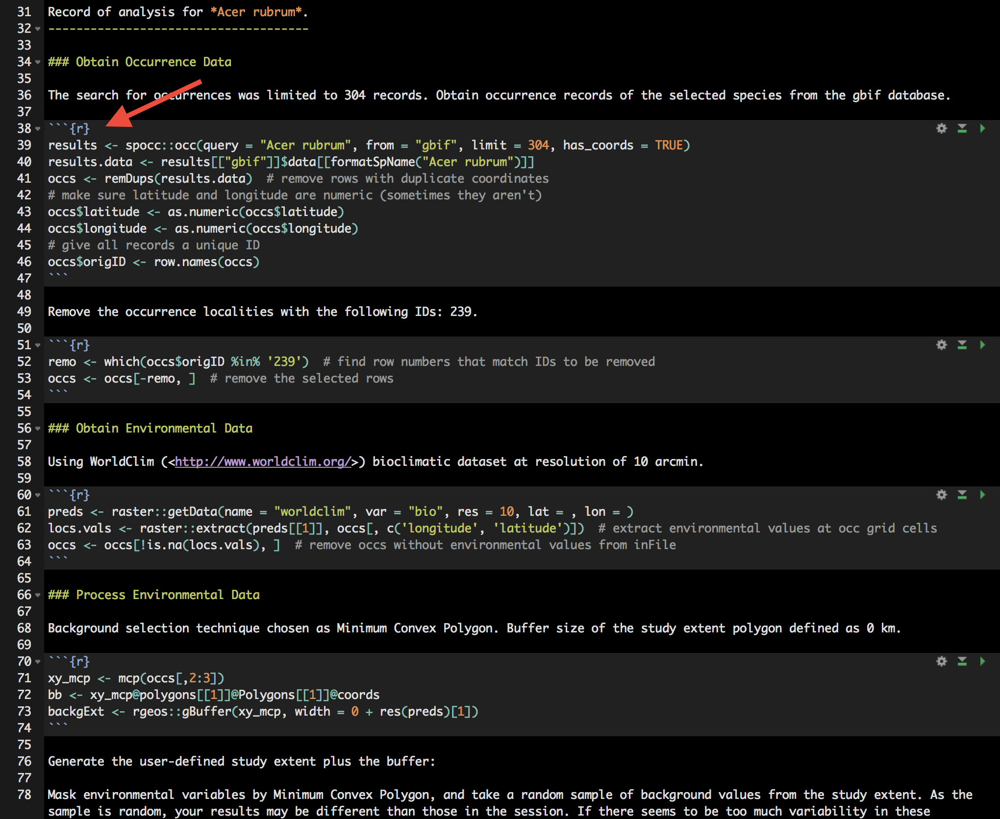
<br>

You might want to open a new R window and try running some of this code. Just note that if you close your `wallace` session you'll lose your progress in the web browser (but your Rmd will be unaffected).

If you use RStudio, you can open this Rmd an click to *knit* to compile your workflow into a sharable html document. Just in case you encountered an error, you can see mine [here](https://cmerow.github.io/RDataScience/4_1_assets/Outputs/wallace-session-2017-01-26.html)

Note that you can change anything you like in this code to build upon your workflow. Future versions of `wallace` will enable you to upload such modified Rmds to `wallace` to fill in all the options you chose and pick up where you left off in a previous analysis in the GUI.

At the moment we don't have anything built into `wallace` for post-processing, so you can use R directly to build from the code created above.

# Improving the model

<div>
<object data="4_1_assets/4_1_SDMs_Decisions.pdf" type="application/pdf" width="100%" height="700px">
  <p>It appears you don't have a PDF plugin for this browser.
   No biggie... you can <a href="4_1_assets/4_1_SDMs_Decisions.pdf">click here to
  download the PDF file.</a></p>
 </object>
 </div>

 <p><a href="4_1_assets/4_1_SDMs_Decisions.pdf">Download the PDF of the presentation</a></p>

[<i class="fa fa-file-code-o fa-3x" aria-hidden="true"></i> The R Script associated with this page is available here](4_1_Wallace_SDMs.R).  Download this file and open it (or copy-paste into a new script) with RStudio so you can follow along.  


Let's revisit that crappy prediction into northern Canada. This issue derived from a poor choice of modeling domain and an overfit model. Try rerunning the analysis by extending the domain to include many locations where the species does not occur (see below) and using a simpler model that includes only linear and quadtratic features.

<br>


<br>

Here are the improved predictions that avoid prediction in northern Canada.

<br>


