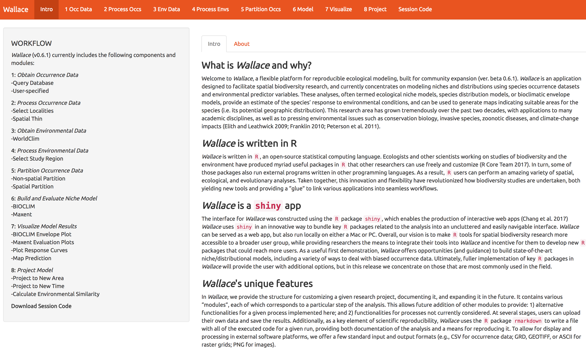
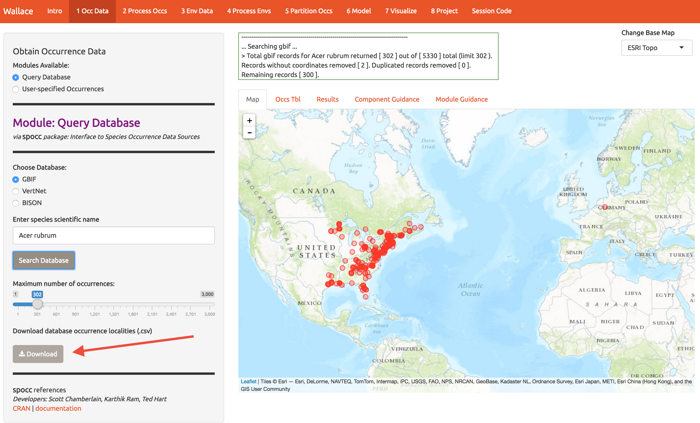
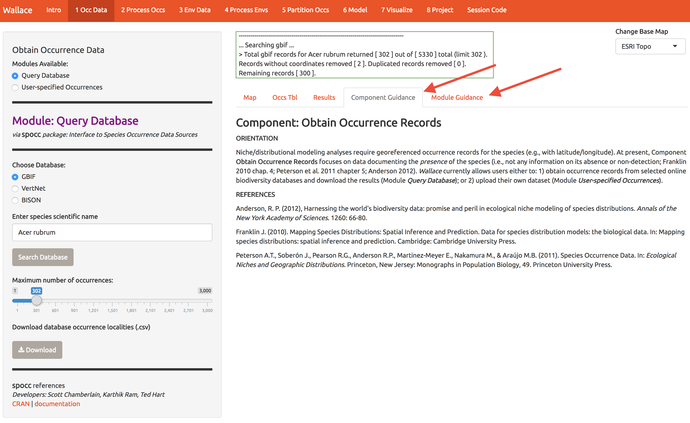

# SDMs with Wallace
Cory Merow  
1/25/2017  


<!-- <div> -->
<!-- <object data="4_1_assets/Wallace_SDMs1.pdf" type="application/pdf" width="100%" height="650px">  -->
<!--   <p>It appears you don't have a PDF plugin for this browser. -->
<!--    No biggie... you can <a href="4_1_assets/Wallace_SDMs1.pdf">click here to -->
<!--   download the PDF file.</a></p>   -->
<!--  </object> -->
<!--  </div> -->

<!--  <p><a href="4_1_assets/Wallace_SDMs1.pdf">Download the PDF of the presentation</a></p>   -->

[<i class="fa fa-file-code-o fa-3x" aria-hidden="true"></i> The R Script associated with this page is available here](4_1_Wallace_SDMs.R).  Download this file and open it (or copy-paste into a new script) with RStudio so you can follow along.  

# Setup
For `wallace` to work, you need the latest version of R.

[Windows](https://cran.r-project.org/bin/windows/base/)

[Mac](https://cran.r-project.org/bin/macosx/)

Load necessary libraries. 

```r
install.packages('knitr',dep=T) # you need the latest version, even if you already have it
install.pacakges('wallace',dep=T)
library(wallace)
run_wallace() # this will open the Wallace GUI in a web browser
```

The `wallace` GUI will open in your web browser and the R command line will be occupied (you only get a prompt back by pushing 'escape'). If you find this annoying and want to use your typical R command line, open a terminal window, type `R` to start R, and then run the lines above in that window. This will tie up your terminal window but not your usual R command line (e.g. RStudio, or the R GUI).

Typing `run_wallace()` will give you the following in your web browser:




# Get Occurrence Data

Start by getting about 300 records of *Acer rubrum* (red maple) from GBIF. Throughout, I'll use a red arrow in the images below to indicate which buttons I'm referring to.




While you're at it, download the data for later use (bottom left).

Notice that there are tabs along the top, and you can view the sources of the occurrence data. Later you can choose to ditch some if it looks suspect.


Each *Module* (the tabs labeled 1-8 at the top of the screen) comes with guidance and references by select the tabs at the right.




# Prep Occurrences

Now let's clean up the data. If we want to model *A. Rubrum* in the US, we can toss that odd point in Europe. Click the point to see it's info and then enter the ID at the left to remove it.


The samples may exhibit spatial autocorrelation, which is best to account for in the model or remove before modeling. For example, there might be a bunch of samples near cities because these are mostly from iNaturalist (citizen science) and citizen often live near cities. So lets spatially thin the points and make sure they're all at least 10km from one another. That left me with 163 points for modeling.


Download these points for later reference.

# Get environmental data

# Prep environmental data

# Partition occurrences

# Model

# Visualize

# Map

# Post-processing (e.g. Richness)
At the moment we don't have anything built into `wallace` for this step, so you can use R directly with the code creates above.

First, you'll need to extract the .Rmd of your analysis.

